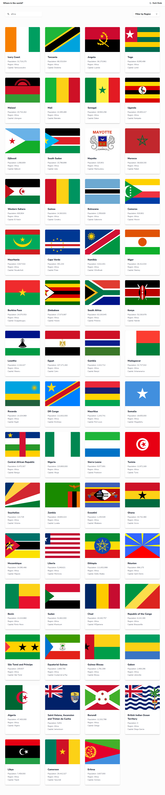

# Frontend Mentor - REST Countries API with color theme switcher solution

This is a solution to the [REST Countries API with color theme switcher challenge on Frontend Mentor](https://www.frontendmentor.io/challenges/rest-countries-api-with-color-theme-switcher-5cacc469fec04111f7b848ca). Frontend Mentor challenges help you improve your coding skills by building realistic projects.

## Table of contents

- [Overview](#overview)
  - [The challenge](#the-challenge)
  - [Screenshot](#screenshot)
  - [Links](#links)
- [My process](#my-process)
  - [Built with](#built-with)
  - [What I learned](#what-i-learned)
  - [Continued development](#continued-development)
  - [Useful resources](#useful-resources)
  - [AI Collaboration](#ai-collaboration)
- [Author](#author)
- [Acknowledgments](#acknowledgments)

**Note: Delete this note and update the table of contents based on what sections you keep.**

## Overview

### The challenge

Users should be able to:

- See all countries from the API on the homepage
- Search for a country using an `input` field
- Filter countries by region
- Click on a country to see more detailed information on a separate page
- Click through to the border countries on the detail page
- Toggle the color scheme between light and dark mode _(optional)_

### Screenshot

### Links

- Solution URL: [Add solution URL here](https://github.com/Esther-Inyang/countries-api)
- Live Site URL: [Add live site URL here](https://countries-api-filter.vercel.app/)

## My process

### Built with

- React
- CSS
- CSS Grid
- Flexbox
- Tailwind
- Mobile-first workflow
- [React](https://reactjs.org/) - JS library
- [Tailwind](https://tailwindcss.com/docs/installation/using-vite) - For styles

### What I learned

I learned to use React ThemeContext for the theme switching. I wanted to build this App to help me even in the future to quickly check countries, regions, continents, their population and capitals. I learned how to consume the countries API so that I can get the correct and current data. I learned to filter by region which was something I really enjoyed figuring out.

### Continued development

For this project, I'd say it's to fetch and display more useful information depending on what I think is necessary.

### Useful resources

- [Example resource 1](https://react.dev/reference/react/createContext) - This React Context Reference really helped me to understand how to use the ThemeContext for my theme switching mode.

### AI Collaboration

I forgot how to actually add the Google font to tailwind and since I am using React vite, it was a bit confusing so I use Claude.ai to figure it out. I ask Claude to describe how I can add Google font to my React and Tailwind application. It gave me a few options which I tried and it worked.

## Author

- Website - [Esther Inyang](https://www.estherinyang.com)
- Frontend Mentor - [@yourusername](https://www.frontendmentor.io/profile/yourusername)
- Twitter - [@realDevEsti](https://www.x.com/realdevesti)
- Linkedin - [Esther Inyang](https://www.linkedin.com/in/estherinyang)

## Acknowledgments

I appreciate my friend Mariam Ademola for being my code buddy. We picked this challenge together, set a timeline and strictly followed it to code everyday independently until we were able to complete our challenge. Knowing that someone else is solving the same challenge gave me the courage to keep going. We even added a fine (payment) to it, whoever missed a day had to pay N2000 Nigerian currency that's about $1.48 and we did that. It was fun and fullfiling. Thank you Mariam!
